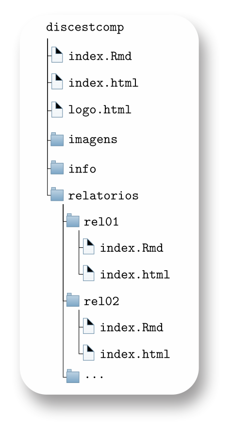

```{r setup, include=FALSE}
knitr::opts_chunk$set(echo = TRUE)
```
--- 


# Visão geral sobre os relatórios {.tabset .tabset-fade}

Este projeto está disponível em <https://github.com/bendeivide/discestcomp.git>.

## O que é necessário?

- Instalar o R: 
  - Windows: <https://cran.r-project.org/bin/windows/base/>
    - rtools: <https://cran.r-project.org/bin/windows/Rtools/>
  - MAC: <https://cran.r-project.org/bin/macosx/>
  - Linux: <https://cran.r-project.org/bin/linux/>
- Instalar o RStudio: <https://www.rstudio.com/products/rstudio/download/>
- Instalar o Git: <https://git-scm.com/downloads>
- Fazer o cadastro no GitHub:
  - Crie um cadastro em: <https://github.com/signup?source=login>
  - Guarde o e-mail utilizado e o seu nome de usuário. Por exemplo, em meu github:
    - Nome: *bendeivide*
      - O seu pode ser encontrado no canto superior direito de sua imagem. Ao clicar na seta ao lado, aparecerá um menu, e a primeira informação é: "*Signed in as nome_usuario*". Esse é o seu nome de usuário ("*nome_usuario*")
    - E-mail: *ben.deivide@gmail.com*
      - Ainda no canto superior direito de sua imagem, no github, ao clicar na seta ao lado, tem uma opção chamada "*Settings*", clique nessa opção, e aparecerá a página de configurações. Na lateral direita, procure por: *Access* > *Emails* > *Primary email address*. Pronto, este é o seu e-mail!
- Instalar Pacotes (No R): 

```{r eval=FALSE}
pkgs <- c("rmarkdown", "knitr", "tinytex")
install.packages(pkgs)
```

## Diretório/Repositório

A estrutura base de nossos relatórios deve seguir a seguinte estrutura de diretório:

- Usando RStudio -> GitBash (Via terminal)
  - Configure o terminal da seguinte forma:
    - *RStudio* > *Tools* > *Global Options...* > *Terminal* > *General* > *Shell* > *New Terminal open with*: *Git Bash* > *Apply* (Botão)
- Crie um repositório no [GitHub](https://github.com) com `<nome_github>.github.io`:
  - Assim, o link do seu repositório será: `<nome_github>.github.io`.
  - Se já existir esse repositório, use `discestcomp`:
    - Assim, o link do seu repositório será: `<nome_github>.github.io/discestcomp`.
- Ao ser criado o repositório GitHub, precisamos copiar o https desse repositório:
  - Entre no repositório > Procure o botão "Code" > Copie o __HTTPS__ . Se considerarmos o nome do repositório como "discestcomp" seria isso: <https://github.com/bendeivide/discestcomp.git>
- Clone no RStudio esse repositório em:
  - File > New Project... > Version Control > Git > Repository URL > insira o *https* do repositório Git;
  - Escolha o diretório onde esse repositório será clonado em seu computador em: "*Create project as subdirectory of:*". Lembre-se de escolher diretórios (pastas) com nomes sem acento, com espaços. De preferência, crie uma pasta no disco C com no "repos", isto é, `C:/repos`^[Pensando no SO Win.]. Caminhos longos dificultam a renderização do projeto. Experiência pessoal!

---

## GitHub/RStudio

Para sincronizarmos as alterações do nosso repositório local com o repositório GitHub, faremos a sequência de comandos:

- Usando o *Git Bash* (Pela aba *Terminal* no RStudio)
  - Adicionar todas as alterações no projeto (localmente)
  - Comentar a alteração (localmente)
  - Enviar as alterações para o respositório `https://github.com/nome_usuario/discestcomp`
  - Nessa ordem, temos os comandos:
  
```github
$ git add .
$ git commit -m "Comentário a ser inserido!"
$ git push
```
Podemos também fazer esses passos por meio de botões no RStudio. No terceiro quadrante, procure pela aba *Git*, depois o botão *Commit*. Ao clicar, abrirá uma nova janela. No seu lado esquerdo será apresentado todos os arquivos alterados. Selecione os arquivos que deseja subi para o GitHub. Ao selecionar, no seu lado direito, haverá um espaço, em *commit message*, para realizar o comentário, vulgarmente chamamos *commitar*. Feito isso, clique no botão *commit*, e depois no botão *push*. Pronto, alterações enviadas!

---

## Estrutura do repositório

A estrutura de nosso projeto será da seguinte forma:


```{r echo=FALSE, fig.align='center', fig.cap='', out.width='40%'}

```

---

# Relatórios

Para *linkar* os relatórios basta usar o código (Exemplo Relatório 01):

```
- [Relatorio 01 (Insira a data)](rel01/index.html)
```
Relatórios desenvolvidos:

- [Relatório 01 (12/04/2022)](rel01/index.html)
- [Relatório 02 (12/04/2022)](rel02/index.html)
- ...