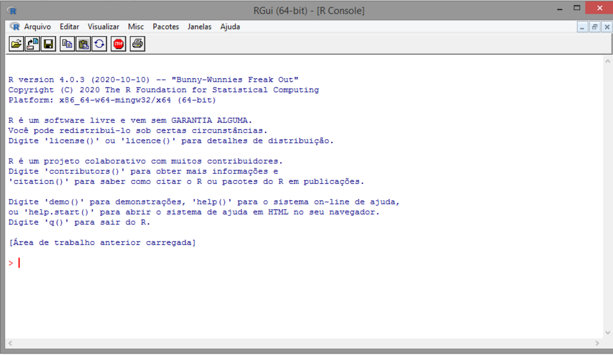

```{r setup, include=FALSE}
knitr::opts_chunk$set(echo = TRUE)
```
--- 

# Objetivo

Descrever as ideias básicas sobre o ambiente R:

- Como instalar o R e o RStudio;
- Diferença entre o R e o IDE RStudio;
- Como o R trabalha;
- Comandos elementares;
- Objetos;
- Manipulação com objetos;
- Importação de dados:
- Pacotes:
  - Instalação;
  - Como usar.

# Apresentação do relatório

Diante do objetivo do relatório, apresentaremos nas próximas subseções os pontos a serem discutidos.

## Como instalar o R e o RStudio
- Instalação do R:
  - Windows: <https://cran.r-project.org/bin/windows/base/>
    - rtools: <https://cran.r-project.org/bin/windows/Rtools/>
  - MAC: <https://cran.r-project.org/bin/macosx/>
  - Linux: <https://cran.r-project.org/bin/linux/>
- Instalação do RStudio: <https://www.rstudio.com/products/rstudio/download/>

## Diferença entre o R e o IDE RStudio
- A principal diferença entre o R e o RStudio está na interface de trabalho. O RStudio é uma versão mais objetiva e organizada do R, facilitando assim o desenvolvimento de *scripts*

  - Interface do R
  
  
  - Interface do RStudio
  
  

## Como o R trabalha
- Como é dito por Chambers, o R possui três princípios:
  - **Princípio do objeto**: Tudo que existe em R é um objeto;
  - **Pincípio da função**: Tudo que acontece em R é uma chamada de função;
  - **Princípio da interface**: Interface para outros programas são parte do R.
  Toda ação executada em R é considerada uma função, que por conseguinte é guardada em um objeto. São estabelecidos argumentos de entrada próprios do criador da função ou já pré-estabelecidos em R, que ficam guardadosna memória ativa do computador, assim como os argumentos de saída, que também são objetos e podem ser exportados de diversas formas.
  
## Comandos elementares
- Os comandos em R ocorrem no **console**, que é onde inserimos essas funções, sempre antecedidos pelo **prompt de comando**, representado de forma padrão pelo símbolo ">", que significa que o console está pronto para receber seus comandos.
- Podemos classificar também as funções como **expressões**, que são qualquer comando executada pelo R, mas ao qual o resultado não é atribuído a nenhum objeto, ou seja, a informação não é armazenada na memória ativa do computador. Ou podemos classificar como **atribuições** quando atribuímos um nome ao objeto, utilizando "<-", dessa forma a informação fica armazenada na memória ativa do computador.

## Objetos
