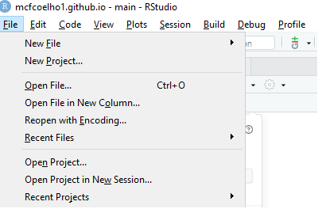

```{r setup, include=FALSE}
knitr::opts_chunk$set(echo = TRUE)
```
--- 

# Objetivo

Descrever como elaborar e compartilhar relatórios a partir do Github:

- Cadastro no GitHub
- Instalação do Git
- Pacotes necessários no RStudio
- Como criar e clonar um repositório no Github
- Utilizando o RMarkdown
- Como comitar um relatório

# Apresentação do relatório

Os relatórios são criados e estruturados no RStudio e compartilhados a partir da exportação dos dados no githut por meio de **Repositórios**. Abaixo será descrito o passo a passo básico para o desenvolvimento de um relatório.

## Cadastro no Github

Para se cadastrar no Github entre na seguinte página: [Cadastro no Github](https://github.com/signup?ref_cta=Sign+up&ref_loc=header+logged+out&ref_page=%2F&source=header-home)

## Instalação do Git

É necessário fazer o download do Git para utilizar a ferramenta atrelada ao RStudio.

Para isso, basta acessar: [Download Git](https://git-scm.com/downloads)

## Pacotes necessários no RStudio

Para o desenvolvimento de relatórios é necessários que alguns pacotes sejam instalados no RStudio, são eles: *knitr*, *rmarkdown* e *tinytex*

Para isso basta acessar a aba **Packages**, que está no 4° quadrante, e busvar pelo nome dos pacotes.

## Como criar e clonar um repositório no Github

- Voltando ao Github, será necessário criar um repositório, conforme demonstração abaixo:


<center>

<center>

Em seguida, é necessário nomear o repositório, deixá-lo publico é selecionar a opção *Add a README file*:

<center>
{width="70%"}
<center>

- Em seguida, é necessário copiar o HTTPS para criar o projeto no RStudio:

<center>

<center>

- O próximo passo é abrir o RStudio, ir à opção *File* e abrir um novo projeto na opção *New project*:

<center>

<center>

Abrirá uma aba e deve ser selecionada a opção *Version control*, em seguida *Git*, que levará à aba onde deverá ser colado o HTTPS do repositório:

<center>
{width="50%"}
<center>

## Utilizando o RMarkdown

- O RMarkdown será a ferramenta utilizada para escrever em si o relatório, a partir opção *Knit* para gerar o arquivo html.

## Como comitar um relatório

No 2° quadrante, teremos opção Git, onde deveremos selecionar a o *Commit*:

<center>

<center>

- A ação seguinte deverá ser selecionar os arquivos, fazer um comentário no quadrante *Commit Message*, selecionar o botão *Commit* e em seguida selecionar o *Push*:

<center>
{width="80%"}
<center>
